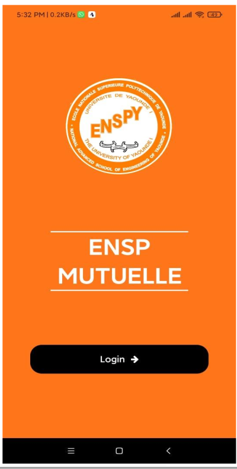

# Application Mobile de Gestion de Mutuelle/Assurance

## Aperçu

Cette application mobile facilite la gestion d'une mutuelle ou d'une assurance en permettant aux membres et aux administrateurs d'effectuer diverses opérations telles que :

* Gestion des membres : Ajouter, modifier, supprimer et consulter les informations des membres.
* Gestion des administrateurs : Ajouter, modifier, supprimer et consulter les informations des administrateurs.
* Gestion des types d'aides : Définir et gérer les différents types d'aides financières offertes par la mutuelle.
* Gestion des cotisations et épargnes : Enregistrer les cotisations obligatoires et les épargnes des membres.
* Gestion des emprunts et remboursements : Gérer les demandes d'emprunt et les remboursements effectués par les membres.
* Gestion des exercices et sessions : Créer et gérer les exercices financiers et les sessions associées.
* Configuration de l'application : Personnaliser certains paramètres de l'application.

## Captures d'écran

* **Écran de connexion** : Permet aux utilisateurs de se connecter à l'application en utilisant leurs identifiants.

    

* **Écran d'accueil** : Affiche un aperçu des fonctionnalités principales, y compris la trésorerie, le fonds social et les événements de la mutuelle.

    

* **Menu principal** : Donne accès aux différentes sections de l'application, telles que les membres, les administrateurs, les types d'aides, etc.

    

* **Gestion des membres** : Permet de visualiser la liste des membres, d'ajouter de nouveaux membres et de consulter/modifier les détails d'un membre existant.

    
    
    

* **Gestion des administrateurs** : Similaire à la gestion des membres, mais spécifique aux administrateurs de la plateforme.

    
    

* **Gestion des types d'aides** : Permet de visualiser, ajouter, modifier et supprimer les différents types d'aides financières proposées par la mutuelle.

    
    
    

* **Configurations** : Permet de modifier certains paramètres de l'application, tels que le montant minimum d'inscription, le montant maximum des cotisations, etc.

    
    

* **Exercices et sessions** : Permet de créer et de gérer les exercices financiers et les sessions associées, ainsi que d'effectuer les opérations liées aux cotisations, épargnes, emprunts et remboursements.

    
    
    

## Technologies utilisées

* Frontend : React Native
* Backend : Python (Django, Django REST Framework)
* Base de données : MySQL
* Déploiement : PythonAnywhere (pour le backend)
* Publication : Google Play Store

## Installation et configuration

### Prérequis :

* Environnement de développement pour React Native (Node.js, npm, etc.)
* Python (version 3.8 ou supérieure)
* Serveur MySQL
* Compte développeur Google Play

### Instructions détaillées :

Se référer aux guides `Guide d'implémentation` et `Guide de déploiement` fournis avec le projet.

## Utilisation

* **Connexion** : Les utilisateurs doivent se connecter avec leurs identifiants pour accéder à l'application.
* **Navigation** : Le menu principal permet d'accéder aux différentes fonctionnalités de l'application.
* **Opérations** : Les utilisateurs peuvent effectuer diverses opérations en fonction de leur rôle (membre ou administrateur), telles que consulter les informations, ajouter de nouveaux membres/administrateurs, gérer les types d'aides, enregistrer les cotisations/épargnes/emprunts/remboursements, etc.
